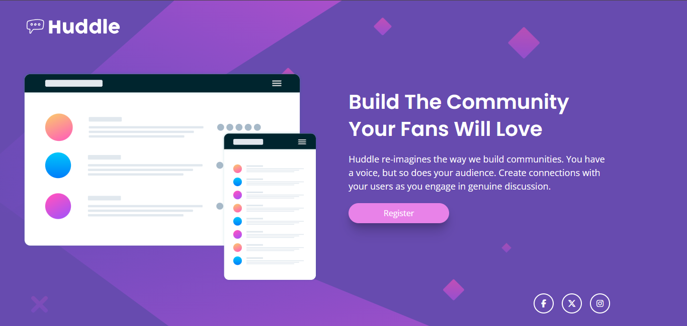

# Proyecto Landing Page "Huddle" - Desafío de FrontendMentor para Novatos 😊

## Introducción

Este proyecto consiste en la construcción de una landing page llamada "Huddle", basada en un desafío de Frontend Mentor. El objetivo principal fue recrear el diseño proporcionado utilizando **HTML** y **Tailwind CSS** para el estilizado, aprovechando la utilidad y rapidez que ofrece este framework para CSS.

## Mi experiencia desarrollndo el proyecto

Para llevar a cabo este desafío, decidí utilizar HTML puro para estructurar el contenido de forma semántica y clara, y Tailwind CSS para el diseño y la maquetación responsiva. Esta combinación me permitió:

-   Crear una estructura limpia y accesible.
-   Implementar estilos de forma rápida y eficiente sin escribir CSS personalizado extenso.
-   Adaptar el diseño para diferentes tamaños de pantalla utilizando las clases responsivas que Tailwind ofrece.
-   Añadir efectos interactivos como estados hover con facilidad.

Durante el desarrollo, me enfoqué en mantener el código organizado y reutilizable, aprovechando las utilidades de Tailwind para manejar márgenes, paddings, tipografías y colores según la guía de estilos del desafío.

## Características principales

-   Diseño responsivo que se adapta perfectamente a dispositivos móviles y escritorio.
-   Uso de hover states para mejorar la experiencia de usuario en elementos interactivos.
-   Implementación fiel al diseño original, respetando paleta de colores, tipografía y distribución.
-   Código limpio y bien estructurado para facilitar futuras modificaciones o ampliaciones.

## Recursos y referencias

-   Documentación oficial de [Tailwind CSS](https://tailwindcss.com/) para la implementación de estilos.
-   Herramientas de desarrollo para probar y ajustar la responsividad.
-   Diseño original y assets proporcionados por Frontend Mentor.

---

## Vista Final del Proyecto

**¡Gracias por visitar este proyecto!**  
Si tienes alguna pregunta o comentario, no dudes en contactarme. 🚀
